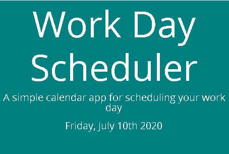

# dailyschedule

## Project Title

This is the 5th Homework Assignment for the Columbia Coding Bootcamp. It is a Daily Planner. Prepare to be organized!

## Project Link

https://jamesrowe1.github.io/dailyschedule/

## Screenshot

## Getting Started

Type any tasks you have into the Task Input Box. To save a task, click the save button, and the task will be saved and persist through reloading the page. Daily tasks will not persist to the next day. If the row is green, then the time has passed and the task is in the past. If the row is red, it is the current time and the task muts be done now. If the row is yellow, the time (and task associated with it) are yet to come.

## Prerequisites

You must have a working web browser.

## Built With

- Visual Studio Code
- HTML
- CSS
- JavaScript
- jQuery
- Bootstrap
- Moment.js
- Chrome
- Hosted by Github

## Authors

James Rowe

## License

Licensed under Awesome Coding L.L.C. (not a real company)

## Troubleshooting

For any issues contact James Rowe

## Acknowledgments

- Ben Wright
- Justin Simero
- Wilson Linares
- And my study group:
- Justin Ramirez
- Michael Haber
- Gabriel Hernandez
- Tiffany Lombardi
- Melissa Mercado
